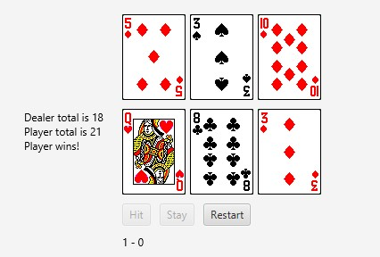

# Blackjack

We had to create a game of 21 that included a visual element i.e. the cards and buttons to “hit” or “stand”. The player and then the dealer would have a chance to draw cards attempting to get a score closest to 21 without going over. The player with the highest score at the end wins and if they have the same score it is a draw. 

## Example Output

## Analysis Steps

This section should restate the assignment and explain how you analyzed the requirements in order 
to develop a solution.

### Design

The first issue I thought I would tackle would be creating an object that would represent a deck of cards. This object has methods to shuffle, create a deck of all the cards, and deal cards out. In this class I created another class that represented a singular card. This card had methods to find the value of the card, the rank, the suit, and the image that could be found in the folder of images of cards.   
I made a player object that held the hand of the player, the number of hands won, the amount of hands lost, and whether or not the player busted. It also contained methods to discard a hand and to add cards to the hand.   
The final step was to set up the visual side of the GUI in the Main class. It had everything that a GUI needed to run and that is what the player used to interact with the program. 

### Testing

To test all I had to do was make a change of some sort that I felt was getting me further and further to the final goal of a functioning game, and when I made that change, I would run the program to see if what I had modified was going to be working. 

## Notes

N/A

## Do not change content below this line
## Adapted from a README Built With

* [Dropwizard](http://www.dropwizard.io/1.0.2/docs/) - The web framework used
* [Maven](https://maven.apache.org/) - Dependency Management
* [ROME](https://rometools.github.io/rome/) - Used to generate RSS Feeds

## Contributing

Please read [CONTRIBUTING.md](https://gist.github.com/PurpleBooth/b24679402957c63ec426) for details on our code of conduct, and the process for submitting pull requests to us.

## Versioning

We use [SemVer](http://semver.org/) for versioning. For the versions available, see the [tags on this repository](https://github.com/your/project/tags). 

## Authors

* **Billie Thompson** - *Initial work* - [PurpleBooth](https://github.com/PurpleBooth)

See also the list of [contributors](https://github.com/your/project/contributors) who participated in this project.

## License

This project is licensed under the MIT License - see the [LICENSE.md](LICENSE.md) file for details

## Acknowledgments

* Hat tip to anyone who's code was used
* Inspiration
* etc
